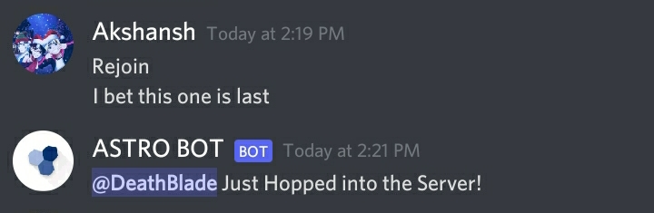
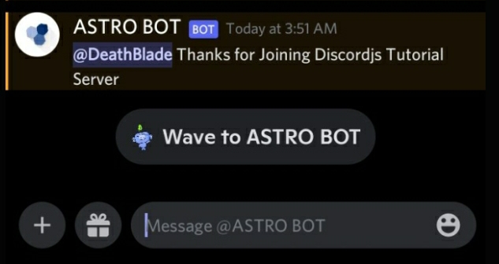

<h1 align="center"> Hello! </h1>

<p align="center"> Djs-zetsu is a npm made for discord.js users to make their work easier! Checkout the functions of this NPM to know more. </p>

<hr />

<h3 align="center"> Install </h3>

```js
npm install djs-zetsu
```

<hr />

<h3 align="center"> Features </h3>

<ul style="list-style: square">
<li> <a href="#Welcome"> Welcome </a> </li>
</ul>

<hr />

<h3 align="center"> Code Examples </h3>

# Welcome
```js
// Define Your DISCORDJS CLIENT & Import Important Things
const { Intents, Client } = require("discord.js")
const client = new Client({
  intents: [
    Intents.FLAGS.GUILDS,
    Intents.FLAGS.GUILD_MEMBERS,
    Intents.FLAGS.GUILD_MESSAGES,
    Intents.FLAGS.DIRECT_MESSAGES,
  ],
  params: ["CHANNEL"],
})

// Import Welcome Func
const { welcome } = require("djs-zetsu")

// Use it
welcome(client, {
  DMmessage: `@MEMBER Thanks for Joining @GUILD`, // Message that will be sent in DM
  message: `@MEMBER Just Hopped into the Server!`, // Message that will be sent in Channel
  channelId: `922497844798181497`, // Channel Id where message will be sent
}) // Welcome func

// You can either use one of DMmessage/message or use both

// DMmessage only:
welcome(client, {
  DMmessage: `@MEMBER Thanks for Joining @GUILD`, // Message that will be sent in DM
})

// Channel only:
welcome(client, {
  message: `@MEMBER Just Hopped into the Server!`, // Message that will be sent in Channel
  channelId: `922497844798181497`, // Channel Id where message will be sent
})
```
<h4> Live Image: </h4>
<p> Channel: </p>

<p> DM: </p>

